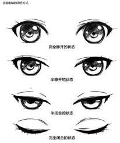

# robot-eyes-ssd1306-esp32
### Matériel
* 1× ESP32 DevKit (3,3 V)
* 2× OLED SSD1306 128×64 I²C (désouder la résistance pour l'adresse 0x78)
* Adresses : 0x3C et 0x3D (jumper ADDR/A0 sur un des écrans)
* Câbles dupont
* Alim 3,3 V 

### Cablâge 
| ESP32       | OLEDs (x2) |
| ----------- | ---------- |
| **3V3**     | VCC        |
| **GND**     | GND        |
| **GPIO 21** | SDA        |
| **GPIO 22** | SCL        |

### Animation

### TO-DOs
- [ ] faire les dessins moi-même
- [ ] clignements "aléatoires"
- [ ] micros-mouvements des yeux ?
